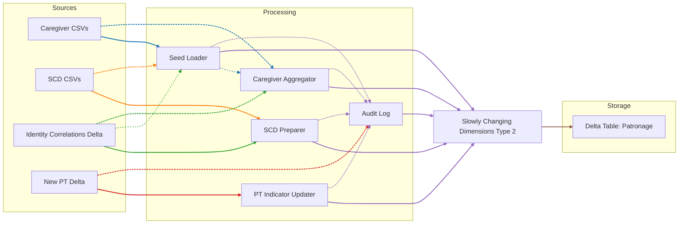
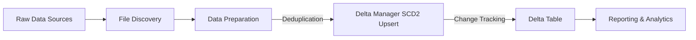
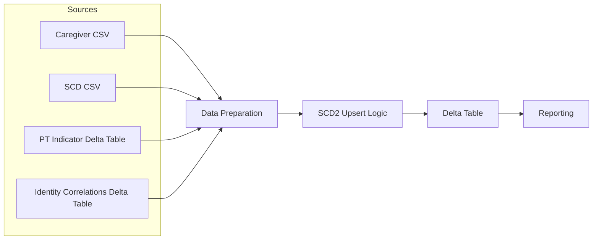
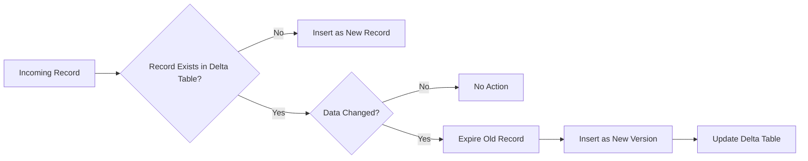

# Patronage ETL Pipeline

A Databricks Patronage data pipeline for ETL processing using Apache Spark and Delta Lake.

---

This document is intentionally architecture-focused; operational runbooks and validation steps live in separate docs.
## High level Architecture

---

## ETL Workflow Diagram

High-level ETL workflow showing the flow from raw sources through processing steps to the Delta table and reporting.

---

## Data Lineage Diagram

Data lineage diagram showing how data moves from all sources, through each transformation, and into the Delta table for reporting.

---

## SCD2 Upsert Logic Flow

SCD2 upsert logic flow showing how new, changed, and unchanged records are handled in the Delta table.

---

## Business Logic Overview

- **Inputs:** Inbound SCD and Caregiver CSVs plus identity-correlation sources and PT indicator Delta sources.
- **Core flow:** Discover inbound CSVs, transform/dedupe/enrich, then SCD2 merge into the Patronage Delta table.
- **SCD2 semantics:** On change, expire the previous active row and insert a new active version; unchanged rows are not rewritten.
- **Operational tasks:** After core processing, scheduled DMDC export and monthly EDIPI backfill may run when gated.

## References
- Delta Lake docs: https://docs.delta.io/latest/delta-intro.html
- PySpark docs: https://spark.apache.org/docs/latest/api/python/

---
