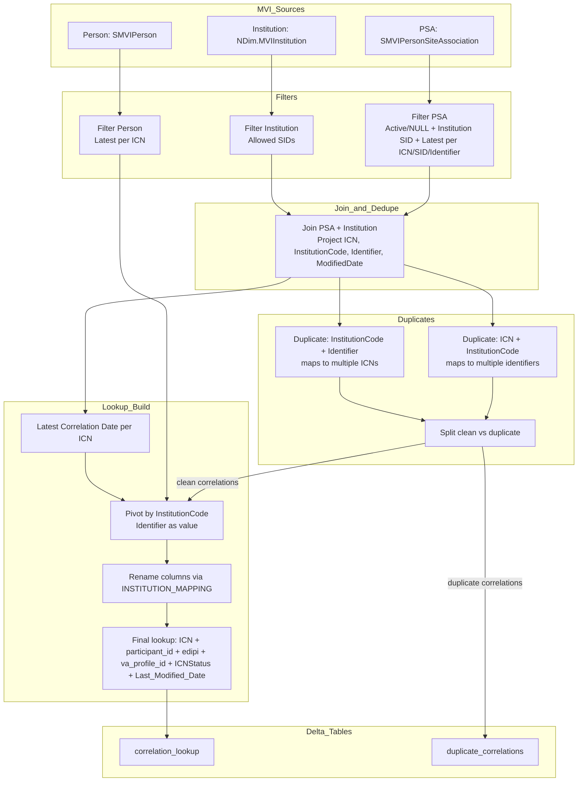

# Identity Correlation & Duplicate Correlation Tables

This document describes how the identity correlation lookup table and the duplicate correlations quarantine table are built in the Patronage pipeline. It is based strictly on the current implementation in `patronage_modularized/identity.py` and configuration in `patronage_modularized/config.py`.

## Document metadata

- Created by Bhavesh Patel
- Last modified: Mar 26, 2025

## Credits

- Pipeline Guidance: Ritesh Sharma (Ritesh.Sharma@va.gov)
- QA testing: Umair Ahmed (Umair.ahmed@va.gov)
- Pipeline build by: Bhavesh Patel (Bhavesh.Patel3@va.gov)

## Runtime environment assumptions

- Built with PySpark and executed in Databricks.
- Source data is read from DBFS mount paths configured in `CORRELATION_CONFIG`.
- Inputs are Parquet files for efficient scanning.

## Purpose

The pipeline builds a wide, per‑ICN lookup table that maps VA ICNs to institution identifiers (e.g., EDIPI, participant_id). Ambiguous relationships are quarantined in a separate table to prevent incorrect mappings from propagating into the eligibility pipeline.

## Source Inputs (MVI)

Configured in `CORRELATION_CONFIG`:

- **PSA (Person Site Association)**
  - Path: `/mnt/ci-mvi/Processed/SVeteran.SMVIPersonSiteAssociation/`
  - Columns used:
    - `MVIPersonICN`
    - `MVITreatingFacilityInstitutionSID`
    - `TreatingFacilityPersonIdentifier`
    - `ActiveMergedIdentifier`
    - `CorrelationModifiedDateTime`
  - Filter:
    - `MVIPersonICN` is not null
    - `MVITreatingFacilityInstitutionSID` is in `INSTITUTION_MAPPING` SIDs (5667, 6061, 6722)
    - `ActiveMergedIdentifier` is `Active` or NULL
  - Window spec:
    - Partition by (`MVIPersonICN`, `MVITreatingFacilityInstitutionSID`, `TreatingFacilityPersonIdentifier`)
    - Order by `CorrelationModifiedDateTime` desc

- **Person**
  - Path: `/mnt/ci-mvi/Processed/SVeteran.SMVIPerson/`
  - Columns used:
    - `MVIPersonICN`
    - `ICNStatus`
  - Window spec:
    - Partition by `MVIPersonICN`
    - Order by `calc_IngestionTimestamp` desc

- **Institution**
  - Path: `/mnt/ci-mvi/Raw/NDim.MVIInstitution/`
  - Columns used:
    - `MVIInstitutionSID`
    - `InstitutionCode`
  - Filter: `MVIInstitutionSID` is in `INSTITUTION_MAPPING` SIDs

## Institution Mapping

Configured in `INSTITUTION_MAPPING`:

- `200CORP` (SID 5667) → `participant_id`
- `200DOD` (SID 6061) → `edipi`
- `200VETS` (SID 6722) → `va_profile_id`

These codes become columns in the final lookup table (after pivot/rename).

## Outputs

Configured in `config.py`:

- **Identity correlation lookup**
  - Table: `correlation_lookup` (`IDENTITY_TABLE_NAME`)
  - Path: `/mnt/ci-patronage/delta_tables/correlation_lookup` (`IDENTITY_TABLE_PATH`)
  - Cluster columns: `MVIPersonICN`, `participant_id`

- **Duplicate correlations quarantine**
  - Table: `duplicate_correlations` (`DUP_IDENTITY_TABLE_NAME`)
  - Path: `/mnt/ci-patronage/delta_tables/duplicate_correlations` (`DUP_IDENTITY_TABLE_PATH`)

## Build Process (Detailed Logic)

### 1) Filter PSA, Person, Institution

- PSA records are filtered to relevant institutions and active/NULL merges, then windowed to keep the most recent row per `(MVIPersonICN, MVITreatingFacilityInstitutionSID, TreatingFacilityPersonIdentifier)`.
- Person records are windowed to keep the most recent row per `MVIPersonICN`.
- Institution records are filtered to only the SIDs in `INSTITUTION_MAPPING`.

### 2) Join PSA → Institution

- PSA is joined to Institution metadata on `MVITreatingFacilityInstitutionSID = MVIInstitutionSID`.
- The join projects:
  - `MVIPersonICN`
  - `InstitutionCode`
  - `TreatingFacilityPersonIdentifier`
  - `CorrelationModifiedDateTime`
- Results are de‑duplicated (`distinct`).

### 2a) Join to Person for ICN status enrichment

- The clean correlations are joined to the latest Person slice by `MVIPersonICN` to bring in `ICNStatus`.

### 3) Identify Duplicate Relationships

Duplicates are defined in two ways:

1. **ICN → InstitutionCode** maps to multiple identifiers
   - Group by (`MVIPersonICN`, `InstitutionCode`) and flag `count > 1`

2. **InstitutionCode → Identifier** maps to multiple ICNs
   - Group by (`InstitutionCode`, `TreatingFacilityPersonIdentifier`) and flag `count > 1`

These two duplicate lists are cached to avoid recomputation.

### 4) Split Clean vs Duplicate Correlations

- The joined dataset is left‑joined to both duplicate lists.
- Clean rows have **no** duplicate flags.
- Duplicate rows have **any** duplicate flag.
- The duplicate set becomes the `duplicate_correlations` table (quarantine); only clean rows flow into the lookup build.

### 5) Build the Wide Lookup Table

- Compute `Last_Modified_Date` per ICN (max of `CorrelationModifiedDateTime`).
- Join clean correlations to the latest‑date table and the person slice.
- Pivot by `InstitutionCode`, aggregating `TreatingFacilityPersonIdentifier`.
- Rename pivot columns using `INSTITUTION_MAPPING` to produce:
  - `participant_id`
  - `edipi`
  - `va_profile_id`
- Ensure all expected columns exist (missing ones are filled with NULL).

### 5a) Final output columns

The lookup output contains one row per `MVIPersonICN` with:

- `MVIPersonICN`
- `participant_id` (from InstitutionCode `200CORP`)
- `edipi` (from InstitutionCode `200DOD`)
- `va_profile_id` (from InstitutionCode `200VETS`)
- `ICNStatus`
- `Last_Modified_Date`

### 6) Persist Tables

- **Identity lookup** is written as a managed Delta table, overwriting schema:
  - `lookup_table.write.option("path", IDENTITY_TABLE_PATH)`
  - `option("overwriteSchema", "true")`
  - `option("clusterBy", "MVIPersonICN,participant_id")`
  - `mode("overwrite")`
  - `saveAsTable(IDENTITY_TABLE_NAME)`
- `OPTIMIZE` is run on the lookup table (Liquid Clustering).
- **Duplicates table** is written as a Delta table at `DUP_IDENTITY_TABLE_PATH` with overwrite mode.

### 7) Cache Cleanup

All cached DataFrames are unpersisted at the end of the build.

## Daily Refresh Behavior

`initialize_identity_lookup()` rebuilds the identity lookup if the table’s `lastModified` date is earlier than today (UTC). Otherwise, it loads and caches the existing table.

## Expected Behavior

- Only the latest PSA and Person records are used (per windowed rank rules).
- Conflicting mappings are quarantined in `duplicate_correlations` and excluded from the lookup.
- The lookup contains a single row per ICN with up to three identifier columns.
- Window functions, joins, and pivots must preserve determinism (latest records win).

## Key Takeaways

- The pipeline prioritizes correctness over completeness by quarantining ambiguous mappings.
- All identifier enrichment is driven by the institution mapping in `config.py`.
- The lookup table is rebuilt daily when stale and reused otherwise.

## Dataflow Diagram

## Key Tables and Columns

### correlation_lookup
- Key: `MVIPersonICN` (renamed to `ICN` when loaded)
- Columns:
  - `participant_id`
  - `edipi`
  - `va_profile_id`
  - `ICNStatus`
  - `Last_Modified_Date`

### duplicate_correlations
- Contains any ICN/identifier rows flagged by duplicate rules.
- Used for quarantine and audit; excluded from lookup output.

## Notes & Guardrails

- All logic is UTC‑anchored by the pipeline runtime.
- Duplicate rules are conservative by design to prevent ambiguous mappings.
- Only institution codes defined in `INSTITUTION_MAPPING` are included in the lookup.
